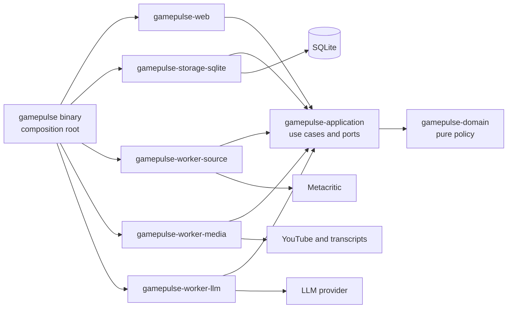

# GamePulse Architecture

- Status: adopted for workspace initialization
- Scope: the GamePulse Rust workspace and its runtime
- Last verified: 2026-08-15
- Requirements: [`docs/requirements.md`](docs/requirements.md)

This file records only durable, non-obvious boundaries that contributors or
agents could otherwise implement incompatibly. Code owns discoverable details
such as complete type layouts and internal helper structure.

## Design paradigm

GamePulse is a multi-crate modular monolith. A virtual Cargo workspace provides
compiler-visible ownership boundaries while one binary still runs the web
server, durable scheduler, queue dispatcher, and three logical worker lanes in
one Tokio process. SQLite on persistent storage owns both application state and
durable job execution state.



## Architecture invariants

### AD-1 — Separate compile-time ownership without splitting deployment

- **Prevents:** infrastructure and process topology growing before the workload
  justifies them.
- **Rule:** the baseline is one virtual Cargo workspace with eight packages,
  seven library crates, one binary crate, one long-running replica, and one
  multithreaded Tokio process. Multiple crates enforce dependency ownership;
  they do not imply multiple services or deployable artifacts.

### AD-2 — Keep delivery adapters thin

- **Prevents:** application behavior being duplicated across HTTP handlers,
  scheduler callbacks, and worker loops.
- **Rule:** `crates/gamepulse/src/main.rs` wires components. Web routes,
  scheduler ticks, and job handlers invoke narrow application use cases. They
  do not own workflow policy.

### AD-3 — Preserve one-way dependencies

- **Prevents:** domain and orchestration code depending on Axum, SQLx, source
  parsing, or a concrete AI provider.
- **Rule:** `gamepulse-application` depends only on `gamepulse-domain` among
  workspace crates. Storage, web, and each worker depend on application and
  domain. The binary composition root depends on every library crate. Reverse
  edges, outer-adapter edges, and worker-to-worker edges are forbidden.

```text
gamepulse binary --------------------------> all library crates
storage / web / each worker --------------> application and domain
application ------------------------------> domain
domain -----------------------------------> no workspace crate
```

### AD-4 — Keep durable work in SQLite

- **Prevents:** queued work disappearing on restart or becoming split between
  in-memory and durable sources of truth.
- **Rule:** SQLite owns jobs, leases, retries, deduplication, and terminal
  execution history. In-memory channels may wake claim loops or broadcast UI
  invalidations only. Execution is at-least-once; writes are idempotent.

### AD-5 — Separate worker lanes by external bottleneck

- **Prevents:** source politeness, media/transcript limits, and LLM budget being
  coupled into one concurrency and retry policy.
- **Rule:** `source`, `media`, and `llm` remain separate crates and logical lanes
  with independent semaphores, timeouts, rate limits, retry ceilings, and
  priorities. Media obtains transcripts but never performs LLM summarization
  synchronously or depends on the LLM worker crate.

### AD-6 — Separate business progress from execution attempts

- **Prevents:** prunable job history becoming the UI source of truth or optional
  YouTube work holding a mandatory run open.
- **Rule:** `runs` and `run_items` own batch and mandatory item progress;
  `summaries` own visible freshness; `jobs` own retryable attempts. A run is
  active only while mandatory discovery, ingestion, critic summary, or user
  summary work is non-terminal. Optional media work never holds it open.

### AD-7 — Hide Metacritic behind a verified source port

- **Prevents:** undocumented endpoint shape, page HTML, or unstable slug rules
  leaking into application logic.
- **Rule:** the first canary verifies list modes, pagination, stable identity,
  details, scores, trailer, genre, and both review kinds. Runtime uses direct
  HTTP when proven. Browser inspection is development evidence, not a baseline
  runtime dependency.

### AD-8 — Keep the UI server-rendered and embedded

- **Prevents:** a separate frontend toolchain and deployment artifact growing
  before client-side complexity exists.
- **Rule:** Axum and Askama own semantic server-rendered pages. Templates,
  migrations, CSS, and minimal JavaScript are embedded in the binary. SSE is an
  invalidation channel over durable database snapshots. WASM is not baseline.

### AD-9 — Keep optional enrichment subordinate to mandatory behavior

- **Prevents:** YouTube quota, missing transcripts, or optional LLM work causing
  mandatory ingestion to fail or starve.
- **Rule:** mandatory review summaries have higher priority than optional media
  work. A missing transcript is a terminal optional outcome. Optional failures
  remain visible but cannot fail mandatory game processing.

### AD-10 — Preserve the evaluation and secret boundary

- **Prevents:** credentials, hidden system data, or private career context
  leaking through the repository or AI transcript.
- **Rule:** secrets are environment-only. Export complete visible project
  prompts and responses, but never credentials, hidden system instructions,
  private chain-of-thought, or unrelated HR context.

## Workspace ownership

| Crate | Owns | May depend on |
| --- | --- | --- |
| `gamepulse-domain` | Entities, value objects, state transitions, pure policy | No workspace crate |
| `gamepulse-application` | Use cases, inbound and outbound ports, orchestration policy | Domain |
| `gamepulse-storage-sqlite` | SQLite repositories, migrations, durable `JobStore` | Application, domain |
| `gamepulse-worker-source` | Scheduler, Metacritic client, source-lane handlers | Application, domain |
| `gamepulse-worker-media` | YouTube search, transcript acquisition, media-lane handlers | Application, domain |
| `gamepulse-worker-llm` | Model client, prompt execution, LLM-lane handlers | Application, domain |
| `gamepulse-web` | Axum routes, Askama templates, SSE, embedded assets | Application, domain |
| `gamepulse` | Configuration and composition root; the only binary | Every library crate |

Worker and delivery crates communicate through application-owned ports and
durable state. They never call each other directly. Concrete storage is injected
by the binary rather than imported by workers or web.

## Durable state ownership

| State | Owner | Purpose |
| --- | --- | --- |
| Games and platform scores | `games`, `game_platform_scores` | Current source data |
| Review source snapshots | `review_snapshots` | Summary inputs and hashes |
| Summary freshness and output | `summaries` | UI-visible LLM state |
| Daily crawl progression | `crawl_days` | New Releases then browse ordering |
| Batch progress | `runs`, `run_items` | Mandatory business lifecycle |
| Execution attempts | `jobs` | Claims, leases, retries, errors |
| Optional media state | `youtube_enrichments` | Video and transcript lifecycle |

## Architecture fitness

The executable architecture gate makes only bounded claims that Cargo can
support reliably:

- the workspace contains exactly the eight adopted packages;
- production targets exactly match seven named normal libraries (`kind = lib`,
  `crate_types = lib`) plus the sole `gamepulse` binary (`kind = bin`,
  `crate_types = bin`); no extra production binary or library target is allowed;
- the complete declared internal Cargo dependency graph, including optional and
  non-normal dependency kinds, matches the adopted allowlist;
- metadata-shaped sabotage fixtures reject a forbidden worker-to-worker edge,
  a second binary, a missing member, an extra ninth member, an extra library
  target, and a retyped library target.

`mise run architecture` runs this gate against live `cargo metadata --no-deps`.
`--no-deps` intentionally avoids resolving external transitive packages while
retaining the workspace package manifests, production target metadata, and
complete direct declared dependency entries the gate inspects. The test
normalizes workspace package identities, manifest dependency paths, and target
metadata; it does not parse Rust source text or use feature-resolved graph
nodes as its dependency source.
Every new architecture rule must state its exact claim and add positive and
negative sabotage evidence before becoming a gate.

Compiler visibility, focused behavior tests, integration tests, mutation tests,
and independent review cover other invariants. A green Cargo graph does not
prove complete architecture conformance and must not be reported as such.

## Current conformance

The repository contains the eight-package workspace harness, one compileable
binary shell, a sabotage-tested Cargo graph gate, the bounded M002 direct-HTTP
Metacritic source-contract canary in `gamepulse-worker-source`, M003's pure
daily-crawl selection policy, M004's SQLite daily-crawl state adapter, M005's
durable job-queue foundation, M006's bounded in-process runtime, and M007's
hourly source-discovery handler. M003 keeps day reset, numeric-ID uniqueness,
source-order selection, the 20-item cap, replay of a partially consumed browse
page, and explicit browse exhaustion in the domain; the application owns the
discovery and atomic state-commit ports. M004 durably commits the per-day state
and selected candidate slugs through that port. M005 adds an application-owned
`JobStore` port plus a SQLite adapter that durably deduplicates stable jobs,
records claims and lease expiry, bounds attempts, fences claim tokens and clock
transitions, rejects stale claim completion, and retains attempt history. M006
adds a Tokio task set in the binary process that derives durable hourly
identities from a clock port, enqueues through `JobStore`, claims no more than
its configured capacity, routes only the application-owned typed job kind, and
joins started tasks after graceful shutdown stops future scheduling and claims.
Completion and failure use the exact durable claim capability; stale or expired
completion is not reported as current success. While accepting work, the
production loop waits on task completion as well as the hourly timer and refills
only capacity made available by a completed task; it does not poll or create an
in-memory work queue. A biased shutdown branch prevents a ready shutdown signal
from losing to the initial or later timer tick.

M007 replaces the production placeholder with a source-lane handler that accepts
only M006's `hour-slot:<canonical decimal>` durable work reference and derives a
bounded UTC `YYYY-MM-DD` crawl key without consulting a local timezone or wall
clock. The application exposes an async source port without a Tokio dependency;
the worker adapter maps its requests to the M002 direct-HTTP list contract,
using New Releases first and the newest-first browse cursor thereafter, then
parses and maps untrusted list data into the existing M003 policy. The binary
alone injects the source adapter and SQLite daily-crawl port. The handler takes
the SQLite mutex separately for state load and atomic commit, never across the
awaited source request. It reports success only after the daily-crawl commit;
malformed references and source, mapping, validation, load, or commit errors
become the existing opaque handler failure so the durable queue alone retains
retry, terminal, claim, and lease ownership. Focused fixture transport tests
cover request mapping and a runtime integration covers durable settlement and
SQLite reopen. They do not call the public source.

M008 adds an offline game-snapshot foundation only. The domain owns the
validated source-agnostic snapshot values; the application owns the one
atomic-upsert port; and SQLite is the only durable adapter. A game is keyed by
the numeric Metacritic product ID, while its source slug remains mutable routing
data. One upsert replaces platform-score and developer collections atomically,
preserving missing cover descriptors, video links, scores, and developers as
explicit optional or empty values. Cover data remains the original descriptor
fields and never becomes a fabricated CDN URL. Deterministic local product-detail
and Userscore fixtures map into this model without a client or source request.

M009 wires the bounded offline vertical only: an hourly discovery commit derives
one `source.game-ingestion` job per selected candidate in the same SQLite
transaction as the daily state and candidate records. The job identity is scoped
to the day and numeric product ID, so replay deduplicates without suppressing a
later-day reprocess; its work reference carries the canonical decimal product ID
and source slug. The application owns the source-ingestion use case, its typed
source and snapshot ports, and the snapshot-persistence boundary. The source
worker remains a thin job handler plus Metacritic adapter: it validates and maps
source-native detail and every detail-listed platform Userscore through M008's
snapshot mapper before the application use case persists the result. Neither
path holds SQLite across an awaited source call. At the atomic commit boundary,
a replayed job identity is accepted only when its job type, work reference, and
maximum attempts exactly match the derived request; a stale slug conflict rolls
back the state, candidates, and jobs together. The binary composes both typed
source handlers and separate SQLite adapters; the dispatcher alone continues
to settle all claims. Deterministic fixtures cover the full scheduler-to-reopen
path, the duplicate-conflict rollback, and malformed, source, mapping, and
store failure settlement without partial snapshots. Reviews, summaries,
runs/run_items, media, LLM behavior, live source requests, and deployment remain
unimplemented.

M010 adds an application-owned catalogue read port and read models over the
M008/M009 snapshot tables. The SQLite adapter performs deterministic
case-insensitive title search, platform filtering, and rating sorting: a
selected platform uses that platform's Metascore, while an unfiltered catalogue
uses each game's maximum Metascore; explicit score-null, title, and identity
tie-breakers keep the result stable. A stored detail reads platform scores,
developers, the original cover descriptor, and video link without manufacturing
source URLs. Since this snapshot schema has no genres, similar games are
selected only from SQLite rows that share a persisted platform or developer;
shared-count ordering falls back to source-product identity. `gamepulse-web`
owns the Axum/Askama server-rendered `/games` and `/games/{id}` delivery
adapter, while the binary injects a separate SQLite read connection and binds
the embedded server in the same process as the unchanged runtime. Fixture tests
seed snapshots through the accepted upsert boundary and never open a listener.

Passing CI proves the bounded workspace
claims and deterministic canary, policy, state-adapter, queue, M006 runtime,
M007 discovery handler, M008 snapshot foundation, and M009 offline vertical; it
also proves M010's deterministic offline catalogue fixtures. It does not prove
complete product behavior or complete architecture conformance.
M006's scheduler identity, dispatcher-capacity, and stale-completion branches
have focused mutation evidence; M009's three allowed manual mutation attempts
were exhausted before the correction pass, which adds no further mutation run.

M003 requires targeted mutation testing because it introduces daily
deduplication, crawl progression, and selection policy.

## Revisit conditions

Revisit crate ownership, process topology, or queue storage only when evidence
shows one of:

- a crate has no durable ownership boundary after three implementation
  milestones;
- a required use case cannot cross the adopted ports without cyclic ownership;
- multiple replicas are required;
- web and workers need independent deployment or scaling;
- SQLite contention persists after WAL, short transactions, indexes, and
  bounded concurrency;
- accepted local transcription needs material CPU, GPU, or memory isolation;
- a source requires a heavyweight browser runtime;
- queue latency violates the evaluator-visible service contract.

Any accepted crate merge, split, new internal edge, or runtime-topology change
updates this spine, the decision record, and architecture sabotage cases before
implementation.
