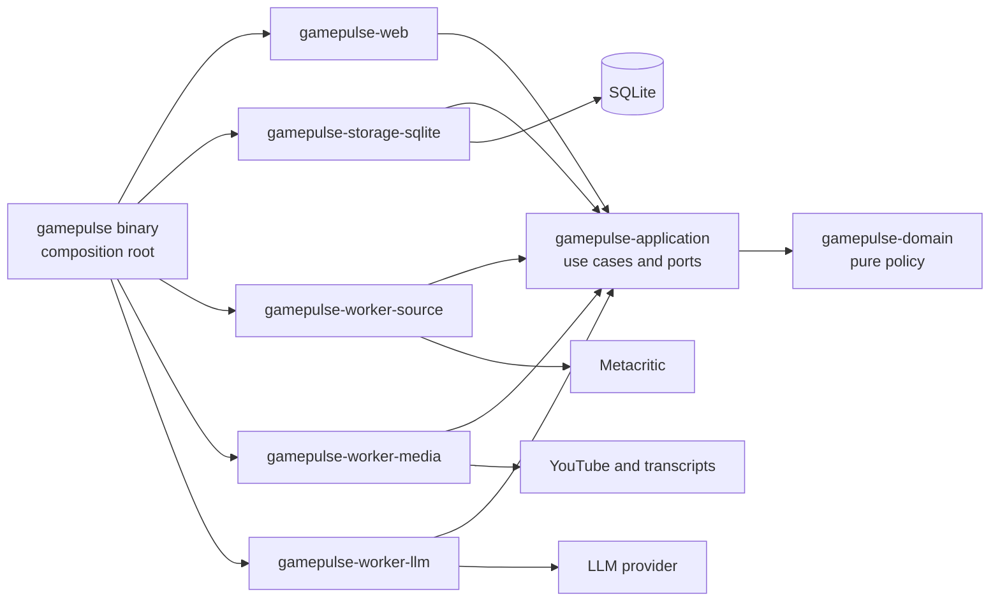

# GamePulse Architecture

- Status: adopted for workspace initialization
- Scope: the GamePulse Rust workspace and its runtime
- Last verified: 2026-08-15
- Requirements: [`docs/requirements.md`](docs/requirements.md)

This file records only durable, non-obvious boundaries that contributors or
agents could otherwise implement incompatibly. Code owns discoverable details
such as complete type layouts and internal helper structure.

## Design paradigm

GamePulse is a multi-crate modular monolith. A virtual Cargo workspace provides
compiler-visible ownership boundaries while one binary still runs the web
server, durable scheduler, queue dispatcher, and three logical worker lanes in
one Tokio process. SQLite on persistent storage owns both application state and
durable job execution state.



## Architecture invariants

### AD-1 — Separate compile-time ownership without splitting deployment

- **Prevents:** infrastructure and process topology growing before the workload
  justifies them.
- **Rule:** the baseline is one virtual Cargo workspace with eight packages,
  seven library crates, one binary crate, one long-running replica, and one
  multithreaded Tokio process. Multiple crates enforce dependency ownership;
  they do not imply multiple services or deployable artifacts.

### AD-2 — Keep delivery adapters thin

- **Prevents:** application behavior being duplicated across HTTP handlers,
  scheduler callbacks, and worker loops.
- **Rule:** `crates/gamepulse/src/main.rs` wires components. Web routes,
  scheduler ticks, and job handlers invoke narrow application use cases. They
  do not own workflow policy.

### AD-3 — Preserve one-way dependencies

- **Prevents:** domain and orchestration code depending on Axum, SQLx, source
  parsing, or a concrete AI provider.
- **Rule:** `gamepulse-application` depends only on `gamepulse-domain` among
  workspace crates. Storage, web, and each worker depend on application and
  domain. The binary composition root depends on every library crate. Reverse
  edges, outer-adapter edges, and worker-to-worker edges are forbidden.

```text
gamepulse binary --------------------------> all library crates
storage / web / each worker --------------> application and domain
application ------------------------------> domain
domain -----------------------------------> no workspace crate
```

### AD-4 — Keep durable work in SQLite

- **Prevents:** queued work disappearing on restart or becoming split between
  in-memory and durable sources of truth.
- **Rule:** SQLite owns jobs, leases, retries, deduplication, and terminal
  execution history. In-memory channels may wake claim loops or broadcast UI
  invalidations only. Execution is at-least-once; writes are idempotent.

### AD-5 — Separate worker lanes by external bottleneck

- **Prevents:** source politeness, media/transcript limits, and LLM budget being
  coupled into one concurrency and retry policy.
- **Rule:** `source`, `media`, and `llm` remain separate crates and logical lanes
  with independent semaphores, timeouts, rate limits, retry ceilings, and
  priorities. Media obtains transcripts but never performs LLM summarization
  synchronously or depends on the LLM worker crate.

### AD-6 — Separate business progress from execution attempts

- **Prevents:** prunable job history becoming the UI source of truth or optional
  YouTube work holding a mandatory run open.
- **Rule:** `runs` and `run_items` own batch and mandatory item progress;
  `summaries` own visible freshness; `jobs` own retryable attempts. A run can
  succeed only at its exact accepted target. A missing mandatory video is a
  closed, fixed-category `run_items` rejection, never a complete game or quota
  increment; the run schedules the next unique candidate or bounded source
  page. Other mandatory failures retain ordinary queue retry/fatal semantics.
  Optional media work never holds a run open.

### AD-7 — Hide Metacritic behind a verified source port

- **Prevents:** undocumented endpoint shape, page HTML, or unstable slug rules
  leaking into application logic.
- **Rule:** the first canary verifies list modes, pagination, stable identity,
  details, scores, trailer, genre, and both review kinds. Runtime uses direct
  HTTP when proven. Browser inspection is development evidence, not a baseline
  runtime dependency. M012 permits one separate, optional public-HTML request
  to `www.metacritic.com/game/{slug}/` per source game-ingestion attempt only
  to read one validated `og:image` declaration. It is never used by catalogue
  or detail reads, never derives a CDN URL, and cannot affect mandatory source
  settlement.

### AD-8 — Keep the UI server-rendered and embedded

- **Prevents:** a separate frontend toolchain and deployment artifact growing
  before client-side complexity exists.
- **Rule:** Axum and Askama own semantic server-rendered pages. Templates,
  migrations, CSS, and minimal JavaScript are embedded in the binary. SSE is an
  invalidation channel over durable database snapshots. WASM is not baseline.

### AD-9 — Keep optional enrichment subordinate to mandatory behavior

- **Prevents:** YouTube quota, missing transcripts, or optional LLM work causing
  mandatory ingestion to fail or starve.
- **Rule:** mandatory review summaries have higher priority than optional media
  work. A missing transcript is a terminal optional outcome. Optional failures
  remain visible but cannot fail mandatory game processing. M012 public cover
  enrichment is a source-lane-only optional substep: one in-process,
  low-concurrency HTML gate has a bounded timeout, body limit, disabled
  redirects and retries, and an until-restart circuit for `403`, `429`, or
  challenge-like HTML. A missing, malformed, duplicate, oversized, non-HTTPS,
  or non-`www.metacritic.com` value persists no public cover URL while the
  mandatory snapshot remains eligible to commit.

### AD-10 — Preserve the evaluation and secret boundary

- **Prevents:** credentials, hidden system data, or private career context
  leaking through the repository or AI transcript.
- **Rule:** secrets are environment-only. Export complete visible project
  prompts and responses, but never credentials, hidden system instructions,
  private chain-of-thought, or unrelated HR context.

### AD-11 — Keep evaluator acceptance one-shot and composition-native

- **Prevents:** a test-only persistence path, an accidental second scheduler,
  or evaluator output disclosing source and local operational data.
- **Rule:** the sole binary may expose one explicit opt-in acceptance subcommand
  for a fresh caller-selected SQLite file. It reuses the production source
  adapters, SQLite stores, durable queue, typed handlers, and local summary
  worker, but starts neither HTTP delivery nor a daemon. It enqueues one
  hourly-discovery identity once, does not reschedule or retry a failed job,
  and waits only for the source-ingestion and review-summary jobs created by
  that fresh cycle. A hard caller deadline aborts active local tasks and
  terminates the command. Its one report contains only fixed outcome categories
  and aggregate counts; it excludes source identities, titles, review content,
  payloads, credentials, URLs, and local paths. The normal hourly runtime and
  its source-lane pacing remain unchanged.

## Workspace ownership

| Crate | Owns | May depend on |
| --- | --- | --- |
| `gamepulse-domain` | Entities, value objects, state transitions, pure policy | No workspace crate |
| `gamepulse-application` | Use cases, inbound and outbound ports, orchestration policy | Domain |
| `gamepulse-storage-sqlite` | SQLite repositories, migrations, durable `JobStore` | Application, domain |
| `gamepulse-worker-source` | Scheduler, Metacritic client, source-lane handlers | Application, domain |
| `gamepulse-worker-media` | YouTube search, transcript acquisition, media-lane handlers | Application, domain |
| `gamepulse-worker-llm` | Model client, prompt execution, LLM-lane handlers | Application, domain |
| `gamepulse-web` | Axum routes, Askama templates, SSE, embedded assets | Application, domain |
| `gamepulse` | Configuration and composition root; the only binary | Every library crate |

Worker and delivery crates communicate through application-owned ports and
durable state. They never call each other directly. Concrete storage is injected
by the binary rather than imported by workers or web.

## Durable state ownership

| State | Owner | Purpose |
| --- | --- | --- |
| Games, platform scores, and validated public cover URL | `games`, `game_platform_scores` | Current source data |
| Review source snapshots | `review_snapshots` | Summary inputs and hashes |
| Summary freshness and output | `summaries` | UI-visible LLM state |
| Daily crawl progression | `crawl_days` | New Releases then browse ordering |
| Batch progress | `runs`, `run_items` | Mandatory business lifecycle |
| Execution attempts | `jobs` | Claims, leases, retries, errors |
| Optional media state | `youtube_enrichments` | Video and transcript lifecycle |

## Architecture fitness

The executable architecture gate makes only bounded claims that Cargo can
support reliably:

- the workspace contains exactly the eight adopted packages;
- production targets exactly match seven named normal libraries (`kind = lib`,
  `crate_types = lib`) plus the sole `gamepulse` binary (`kind = bin`,
  `crate_types = bin`); no extra production binary or library target is allowed;
- the complete declared internal Cargo dependency graph, including optional and
  non-normal dependency kinds, matches the adopted allowlist;
- metadata-shaped sabotage fixtures reject a forbidden worker-to-worker edge,
  a second binary, a missing member, an extra ninth member, an extra library
  target, and a retyped library target.

`mise run architecture` runs this gate against live `cargo metadata --no-deps`.
`--no-deps` intentionally avoids resolving external transitive packages while
retaining the workspace package manifests, production target metadata, and
complete direct declared dependency entries the gate inspects. The test
normalizes workspace package identities, manifest dependency paths, and target
metadata; it does not parse Rust source text or use feature-resolved graph
nodes as its dependency source.
Every new architecture rule must state its exact claim and add positive and
negative sabotage evidence before becoming a gate.

Compiler visibility, focused behavior tests, integration tests, mutation tests,
and independent review cover other invariants. A green Cargo graph does not
prove complete architecture conformance and must not be reported as such.

## Current conformance

The repository contains the eight-package workspace harness, one compileable
binary shell, a sabotage-tested Cargo graph gate, the bounded M002 direct-HTTP
Metacritic source-contract canary in `gamepulse-worker-source`, M003's pure
daily-crawl selection policy, M004's SQLite daily-crawl state adapter, M005's
durable job-queue foundation, M006's bounded in-process runtime, and M007's
hourly source-discovery handler. M003 keeps day reset, numeric-ID uniqueness,
source-order selection, the 20-item cap, replay of a partially consumed browse
page, and explicit browse exhaustion in the domain. M021 makes a later browse
selection follow at most eight validated continuation pages until it has exactly
20 unique candidates; source exhaustion returns a fail-closed outcome with no
commit, so a replayed 24-item page cannot commit its remaining four alone.
The application owns the discovery and atomic state-commit ports. M004 durably commits the per-day state
and selected candidate slugs through that port. M005 adds an application-owned
`JobStore` port plus a SQLite adapter that durably deduplicates stable jobs,
records claims and lease expiry, bounds attempts, fences claim tokens and clock
transitions, rejects stale claim completion, and retains attempt history. M006
adds a Tokio task set in the binary process that derives durable hourly
identities from a clock port, enqueues through `JobStore`, claims no more than
its configured capacity, routes only the application-owned typed job kind, and
joins started tasks after graceful shutdown stops future scheduling and claims.
Completion and failure use the exact durable claim capability; stale or expired
completion is not reported as current success. While accepting work, the
production loop waits on task completion as well as the hourly timer and refills
only capacity made available by a completed task; it does not poll or create an
in-memory work queue. A biased shutdown branch prevents a ready shutdown signal
from losing to the initial or later timer tick.

M007 replaces the production placeholder with a source-lane handler that accepts
only M006's `hour-slot:<canonical decimal>` durable work reference and derives a
bounded UTC `YYYY-MM-DD` crawl key without consulting a local timezone or wall
clock. The application exposes an async source port without a Tokio dependency;
the worker adapter maps its requests to the M002 direct-HTTP list contract,
using New Releases first and the newest-first browse cursor thereafter, then
parses and maps untrusted list data into the existing M003 policy. The binary
alone injects the source adapter and SQLite daily-crawl port. The handler takes
the SQLite mutex separately for state load and atomic commit, never across the
awaited source request. It reports success only after the daily-crawl commit;
malformed references and source, mapping, validation, load, or commit errors
become the existing opaque handler failure so the durable queue alone retains
retry, terminal, claim, and lease ownership. Focused fixture transport tests
cover request mapping and a runtime integration covers durable settlement and
SQLite reopen. They do not call the public source.

M008 adds an offline game-snapshot foundation only. The domain owns the
validated source-agnostic snapshot values; the application owns the one
atomic-upsert port; and SQLite is the only durable adapter. A game is keyed by
the numeric Metacritic product ID, while its source slug remains mutable routing
data. One upsert replaces platform-score and developer collections atomically,
preserving missing cover descriptors, video links, scores, and developers as
explicit optional or empty values. Cover data remains the original descriptor
fields and never becomes a fabricated CDN URL. Deterministic local product-detail
and Userscore fixtures map into this model without a client or source request.

M009 wires the bounded offline vertical only: an hourly discovery commit derives
one `source.game-ingestion` job per selected candidate in the same SQLite
transaction as the daily state and candidate records. The job identity is scoped
to the day and numeric product ID, so replay deduplicates without suppressing a
later-day reprocess; its work reference carries the canonical decimal product ID
and source slug. The application owns the source-ingestion use case, its typed
source and snapshot ports, and the snapshot-persistence boundary. The source
worker remains a thin job handler plus Metacritic adapter: it validates and maps
source-native detail and every detail-listed platform Userscore through M008's
snapshot mapper before the application use case persists the result. Neither
path holds SQLite across an awaited source call. At the atomic commit boundary,
a replayed job identity is accepted only when its job type, work reference, and
maximum attempts exactly match the derived request; a stale slug conflict rolls
back the state, candidates, and jobs together. The binary composes both typed
source handlers and separate SQLite adapters; the dispatcher alone continues
to settle all claims. Deterministic fixtures cover the full scheduler-to-reopen
path, the duplicate-conflict rollback, and malformed, source, mapping, and
store failure settlement without partial snapshots. Reviews, summaries,
runs/run_items, media, LLM behavior, live source requests, and deployment remain
unimplemented.

M010 adds an application-owned catalogue read port and read models over the
M008/M009 snapshot tables. The SQLite adapter performs deterministic
case-insensitive title search, platform filtering, and rating sorting: a
selected platform uses that platform's Metascore, while an unfiltered catalogue
uses each game's maximum Metascore; explicit score-null, title, and identity
tie-breakers keep the result stable. A stored detail reads platform scores,
developers, the original cover descriptor, and video link without manufacturing
source URLs. Since this snapshot schema has no genres, similar games are
selected only from SQLite rows that share a persisted platform or developer;
shared-count ordering falls back to source-product identity. `gamepulse-web`
owns the Axum/Askama server-rendered `/games` and `/games/{id}` delivery
adapter, while the binary injects a separate SQLite read connection and binds
the embedded server in the same process as the unchanged runtime. Fixture tests
seed snapshots through the accepted upsert boundary and never open a listener.

M011 completes the bounded offline review-to-summary vertical for stored games. A source
ingestion refresh retrieves at most the first 20 synthetic fixture reviews independently for
each critic and user kind, maps bounded untrusted excerpts and clear score-derived polarity into source-agnostic review inputs,
and computes individual input hashes plus one combined refresh fingerprint. Inputs with no
polarity retain their exact v5 hash encoding; inputs with any polarity use a domain-separated
v2 encoding. SQLite atomically
replaces the game snapshot and both kind-separated review inputs, then creates exactly two
fingerprint-scoped `llm.review-summary` jobs; an exact replay leaves the current jobs unchanged.
The application owns typed lane claims, review/summarizer ports, refresh scheduling, and the
fenced summary write. The source lane may claim only source job types, while the LLM lane may
claim only summary jobs; SQLite remains the only durable queue, lease, retry, and settlement
authority. The local deterministic extractive fallback is composed in the binary behind the
summarizer port and uses only persisted excerpts to produce separate critic and user
likes/dislikes results, or an explicit unavailable result when no excerpts exist. A summary write
matches both kind and refresh fingerprint, so an old worker result cannot replace the current
refresh. The catalogue detail read model and `/games/{id}` render only persisted critic and user
outputs, including the unavailable state. M021's local fallback classifies explicit positive,
negative, negated, mixed, and unknown excerpt text deterministically; it consults persisted
polarity only when text is unknown. All M011 tests use local synthetic fixtures and
in-process HTTP rendering; they make no source or provider call.

M012 adds one bounded optional public-HTML cover-enrichment substep to the
source adapter. At most one GET to the public game page can be attempted for a
game-ingestion attempt; the source-side gate permits one in-flight HTML request
and skips rather than queues a competing attempt. It accepts exactly one
effective, non-empty, bounded `og:image` declaration in HTML data context only
when its once-decoded parsed URL is HTTPS with exact host
`www.metacritic.com`; the accepted value is persisted atomically with the
existing snapshot and rendered only from SQLite. The optional future runs beside
mandatory source work but is dropped when that work settles first, so it cannot
consume the mandatory job lease. The HTML client has its own timeout, body cap,
no redirects, and no retries. `403` and `429` latch the until-restart circuit
from response headers before any body read; challenge-like read HTML does too.
All optional failure paths store no URL and leave snapshot, review refresh,
queue settlement, daily selection, and summary behavior unchanged. The durable
run boundary is independent of optional cover results; a cover failure neither
changes candidate acceptance nor source progression.

M021 renders a validated public cover URL only after source enrichment and SQLite snapshot
persistence have carried it into the catalogue read model. Catalogue and detail templates use the
persisted value directly without a server-side or render-time fetch; an absent URL retains the
safe local placeholder. The original source descriptor remains provenance data and is never
converted into a fabricated image URL.

M013 adds local delivery readiness without changing the one-binary,
one-process topology. `gamepulse-web` owns `GET /health/live` and
`GET /health/ready`; the first returns without a database or external-source
dependency, while the second calls an application-owned readiness port only.
The SQLite adapter reopens the configured persistent database read-only and
checks database integrity, the adopted migration version, and required schema
structure without applying migrations, claiming jobs, or invoking a source
adapter. The composition root alone
supplies that adapter and the explicitly configured bind address. If SQLite
cannot initialize, the binary serves only liveness/readiness and returns no
catalogue data; it composes neither worker runtime nor source client. A local
source-work disablement is limited to offline binary smoke evidence; the live
source canary remains a separate, explicit action. The container remains a
non-root wrapper around the sole binary and mounts SQLite outside the image;
one replica with one persistent volume is the only supported deployment shape.

M014 adds local-only structured observability at the binary composition boundary.
`GAMEPULSE_LOG_FORMAT` is required and accepts exactly `human` or `json`; an
absent, non-Unicode, or unsupported value prevents startup without reflecting
the supplied value. The binary installs the sole `tracing-subscriber` before
opening SQLite, binding HTTP, or composing workers. Human output is time-free
and ANSI-free for deterministic local inspection; JSON output is one structured
event per line. Events contain only fixed categories and bounded operational
fields: lifecycle, a process-local request ID, normalized method and route
class, response status, elapsed time, scheduler enqueue/tick, durable job
kind/attempt/settlement/latency, source-stage aggregate, source-ingestion
failure category, optional-cover availability category, and review-summary
kind/outcome. They never include
bodies, query strings, title searches, review text, URLs, headers, cookies,
credentials, database paths, local paths, or raw errors. Tracing remains an
outer-adapter concern: domain, application, and durable storage behavior
neither depend on it nor use it for decisions. When
`GAMEPULSE_SOURCE_WORK_ENABLED=false`, the binary does not compose source
clients or source handlers; this setting is the exact local offline smoke
contract. The source-disabled smoke binds only loopback, uses a temporary
SQLite file outside the repository, verifies liveness, readiness, one catalogue
request, and graceful shutdown, then removes that data. It makes no source or
other external request.

The sole subscriber layer admits exactly the binary-owned targets
`gamepulse::lifecycle`, `gamepulse::http`, `gamepulse::scheduler`,
`gamepulse::durable`, `gamepulse::source`, and `gamepulse::review_summary`.
All other targets, including dependency warnings and errors, are filtered before
human or JSON formatting, so foreign message fields cannot disclose URLs,
paths, or raw error text through this logging surface.

Passing CI proves the bounded workspace
claims and deterministic canary, policy, state-adapter, queue, M006 runtime,
M007 discovery handler, M008 snapshot foundation, and M009 offline vertical; it
also proves M010's deterministic offline catalogue fixtures and M011's synthetic
review-to-summary vertical. It does not prove
complete product behavior or complete architecture conformance.
M006's scheduler identity, dispatcher-capacity, and stale-completion branches
have focused mutation evidence; M009's three allowed manual mutation attempts
were exhausted before the correction pass, which adds no further mutation run.

M013 adds focused local liveness/readiness response coverage and SQLite schema
readiness coverage. Mutation testing is not applicable to the thin readiness
adapter and status mapping: its two observable branches are deterministic,
covered directly, and it owns no critical state-machine, lease, retry,
deduplication, crawl-progression, run-finalization, or selection-policy rule.

M014 adds focused configuration, redaction, request-correlation, and safe
outcome-field coverage plus a direct source-disabled binary smoke. Mutation
testing is not applicable: the instrumentation is an adapter-only projection
with no state transition, persistence rule, retry/lease decision, or selection
policy; the documented log-format choices and selected fixed category mappings
are asserted directly, not every scheduler/runtime observable-outcome category.
The focused smoke is a deterministic child-process test of the actual binary
initializer. It uses loopback only, a temporary external SQLite file, at most
40 readiness probes at 100 ms, both log formats, a query-bearing catalogue
request, invalid-config failure, and SIGINT shutdown. A regression test emits a
foreign warning containing URL-like error text and proves that the exact target
allowlist suppresses it while retaining a GamePulse event.

M016 adds a bounded source-ingestion diagnostic path. The source worker reduces
terminal game-ingestion failures to exactly `review_continuation_link` when its
mandatory review-page parser rejects a continuation, or
`other_mandatory_stage` for every other mandatory-path failure. Those fixed
values are the durable handler failure data and the only source-ingestion
failure categories emitted through the binary-owned observability boundary. No
source error, link, URL component, request value, or response material crosses
either boundary. M017 adds one separately authorized source-adapter rule: a
review-page `next` object with an absent `href` field may be terminal only when
the requested offset plus parsed item count equals the declared total under
checked arithmetic. M034R extends that same exact-exhaustion rule to a JSON
`href: null` after bounded aggregate-only live evidence observed that shape. A
missing `links.next` preserves the established terminal behavior; explicit
`next: null`, non-exhausted review placeholders, and all finder/list
placeholders remain rejected. M015's critic first-page effective-page-size
rule and all non-empty continuation validation remain unchanged.

M035 makes the assignment's stored video link an eligibility requirement for
mandatory source ingestion. The source-adapter parser may still represent an
absent backend video field structurally, but `MetacriticGameReviewSource` must
reject that detail before fetching dependent mandatory fields or constructing a
review refresh. The handler records the existing safe
`other_mandatory_stage` failure category; it persists no game, review input,
summary, or summary job for that attempt. The source-agnostic snapshot model
continues to represent an absent video for non-mandatory fixtures and reads.

M003 requires targeted mutation testing because it introduces daily
deduplication, crawl progression, and selection policy.

M023 extends the exact-20 rule to the first daily New Releases selection: a
short page continues through at most eight newest-first browse pages, and only
an atomic 20-candidate state/job commit is successful. Exhaustion leaves no
partial selection committed. SQLite owns retry eligibility and a source-lane
next-claim timestamp, so deterministic retry backoff and pacing survive a
restart without a database transaction sleeping or an in-memory timer becoming
queue truth. The source runtime composes the source-lane pace; the queue applies
it atomically with a claim while preserving the existing 300-second leases and
claim fencing. [`mise run mutation`](docs/mutation-testing.md) runs three declared temporary source-tree
mutants against focused exact-20 regressions, classifies caught, noncompiling,
and surviving mutants, has a hard three-mutant ceiling, and fails on a survivor.

M038 adds the explicit evaluator acceptance command. Its one-shot coordinator
uses the existing durable runtime for exactly one hourly-discovery enqueue, the
same production worker-handler composition, and a separate SQLite aggregate
read port. It uses no HTTP listener, timer-driven scheduler loop, retry pass,
or second discovery enqueue. The command accepts only the current mandatory
20-game target, because the domain's daily selection and atomic commit invariant
is exactly 20. Its fresh-path precondition scopes every source-ingestion and
summary job in the database to this one cycle; the aggregate reader never
exposes raw records. It retains the production source lane's persisted claim
pacing, waiting only until SQLite's next eligible claim time within the hard
deadline; this is not a second enqueue. Retryable source failures retain the
existing durable attempt budget and persisted backoff. Focused fixture-only
integration tests cover the single discovery invocation, bounded durable retry,
exact target, cycle-scoped summary drain,
deadline, job failure, target failure, and report privacy. A dedicated
three-mutant offline harness exercises the one-shot termination decisions;
normal source calls remain outside CI and this milestone.

M054 replaces the superseded fixed-20-candidate settlement in the production
source composition with one durable exact-target run. A forward SQLite
migration adds `runs` (day, target, phase/cursor, durable eight-page browse
bound, accepted count, deadline, and version/progress fence) and `run_items`
(stable source identity, routing slug, discovery order, lifecycle, and the
closed `missing_required_video` category). The source worker obtains one
candidate job from this state at a time. A valid
missing-video detail settles that candidate as rejected without any snapshot,
review, summary, or quota write, then atomically schedules the next candidate
or bounded browse page. A successful refresh persists the game/reviews and
increments accepted count in one transaction; exactly target completes the
run. The handler exposes the queue claim's bounded token/expiry fence; each
run transaction validates the active queue state, matching fence, unexpired
lease, and run deadline before it changes a page, item, game, or rejection.
Item state plus job identity, run version, and progress fence make stale or
replayed work idempotent and prevent overfill. Source exhaustion and deadline
are durable failed run terminals whose current source job settles successfully,
without a retry; fixed missing-video observations remain aggregate-only even
on that successful settlement. The normal hourly runtime and acceptance
composition share these handlers; legacy direct-handler fixtures remain only
compatibility coverage, not a second production flow.

## Revisit conditions

Revisit crate ownership, process topology, or queue storage only when evidence
shows one of:

- a crate has no durable ownership boundary after three implementation
  milestones;
- a required use case cannot cross the adopted ports without cyclic ownership;
- multiple replicas are required;
- web and workers need independent deployment or scaling;
- SQLite contention persists after WAL, short transactions, indexes, and
  bounded concurrency;
- accepted local transcription needs material CPU, GPU, or memory isolation;
- a source requires a heavyweight browser runtime;
- public HTML bot protection or HTML-schema drift makes optional cover
  enrichment consistently unavailable, or an observable completed fixed
  20-item source batch shows more than four public-cover parse-or-validation
  failures and justifies an explicitly designed batch-level disablement model;
- queue latency violates the evaluator-visible service contract.

Any accepted crate merge, split, new internal edge, or runtime-topology change
updates this spine, the decision record, and architecture sabotage cases before
implementation.
